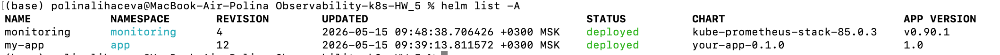
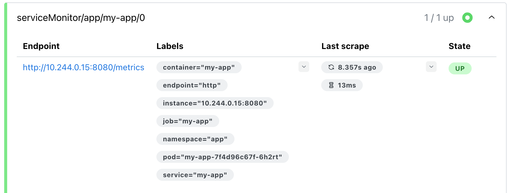
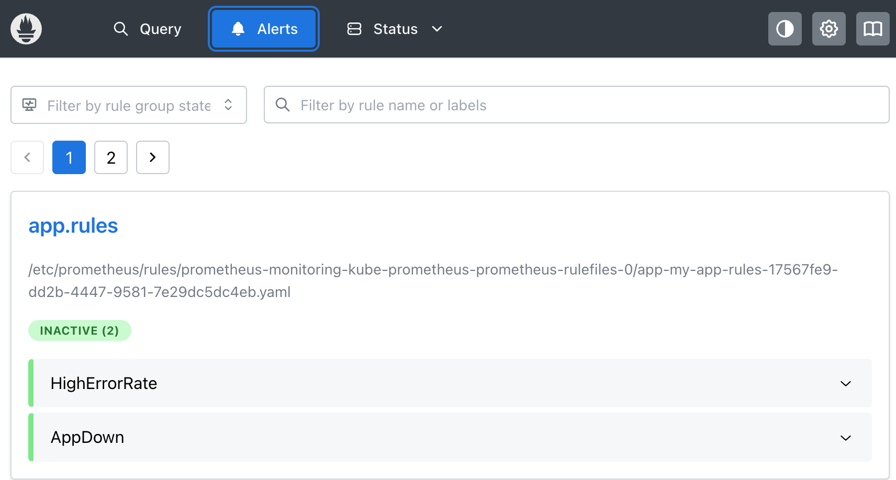
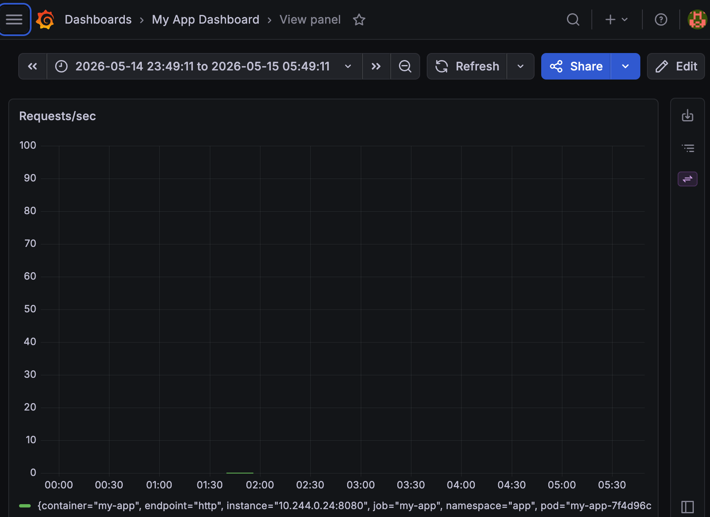

## Observability Kubernetes
### Вариант 2 — Helm

#### Структура проекта
```
.
├── .DS_Store
├── app
│   ├── .DS_Store
│   ├── Dockerfile
│   ├── go.mod
│   ├── go.sum
│   └── main.go
├── helm
│   ├── monitoring-values.yaml
│   └── my-app
│       ├── Chart.yaml
│       ├── templates
│       │   ├── deployment.yaml
│       │   ├── prometheusrule.yaml
│       │   ├── service.yaml
│       │   └── servicemonitor.yaml
│       └── values.yaml
└── README.md

5 directories, 14 files
```


---

#### Запуск проекта

1. Создание кластера

```bash
kind create cluster
```

2. Установка monitoring stack

```bash
helm repo add prometheus-community https://prometheus-community.github.io/helm-charts
helm repo update

helm install monitoring prometheus-community/kube-prometheus-stack \
  -n monitoring --create-namespace \
  -f helm/monitoring-values.yaml
```

3. Сборка приложения

```bash
cd app
docker build -t my-app:latest .
```
4. Загрузка image в kind

```bash
kind load docker-image my-app:latest
```

5. Деплой приложения

```bash
helm upgrade --install my-app ./helm/my-app -n app --create-namespace
```

#### Скриншоты

1. `helm list -A`

2. Prometheus Targets (UP)

3. Prometheus Alerts (Firing)
   
4. Grafana Dashboard
